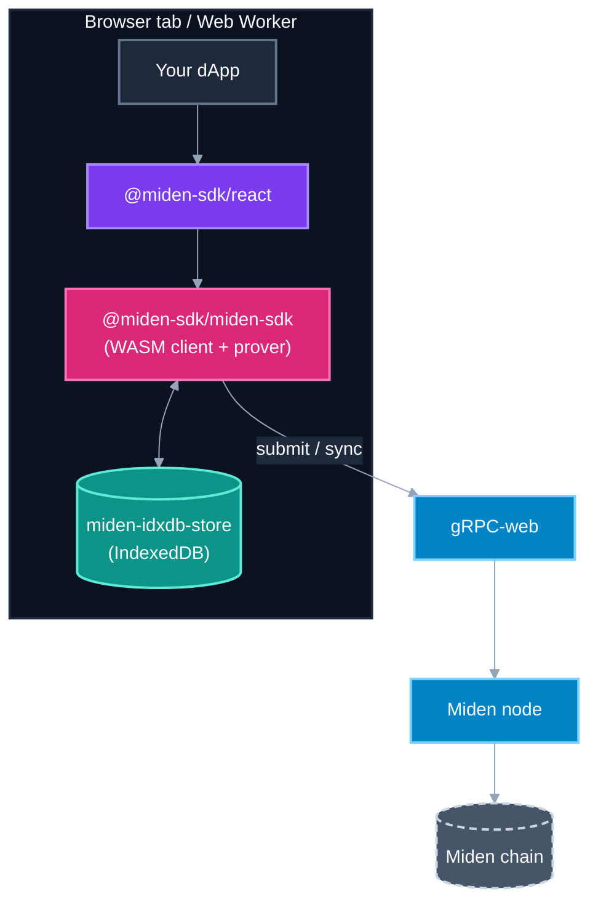

<div align="center">

# Miden Web SDK

**The browser- and JavaScript-native SDK for the [Miden network](https://miden.xyz).**

WASM-powered client, React hooks, and Vite tooling — sign, send, and prove transactions from a tab.

[](https://github.com/0xMiden/web-sdk/actions/workflows/test.yml)
[](https://github.com/0xMiden/web-sdk/actions/workflows/test.yml?query=branch%3Amain)
[](https://www.npmjs.com/package/@miden-sdk/miden-sdk)
[](https://www.npmjs.com/package/@miden-sdk/react)
[](rust-toolchain.toml)
[](LICENSE)

</div>

---

## What's in here

This repo packages everything you need to interact with Miden from a browser, a Web Worker, or a React app:

| Package | Purpose | Install | Docs |
|---|---|---|---|
| **[`@miden-sdk/miden-sdk`](https://docs.miden.xyz/builder/tools/clients/web-client/)** | The Rust client compiled to WASM, with TypeScript bindings. The brains of the operation — accounts, notes, transactions, proving, RPC. | `pnpm add @miden-sdk/miden-sdk` | [Web Client docs ↗](https://docs.miden.xyz/builder/tools/clients/web-client/) |
| **[`@miden-sdk/react`](https://docs.miden.xyz/builder/tools/clients/react-sdk/)** | React hooks (`useAccount`, `useNotes`, `useSend`, `useConsume`, ...) over the WASM client. Signer-agnostic — pluggable with MidenFi, Para, Turnkey. | `pnpm add @miden-sdk/react` | [React SDK docs ↗](https://docs.miden.xyz/builder/tools/clients/react-sdk/) |
| **`@miden-sdk/vite-plugin`** | Drop-in Vite plugin that handles WASM dedup, the worker-context node polyfills, and a few footguns we're tired of stepping on. | `pnpm add -D @miden-sdk/vite-plugin` | — |
| **`miden-idxdb-store`** *(Rust crate)* | The IndexedDB-backed store the WASM client uses for persisting accounts, notes, MMR data, and sync state. Published to crates.io for Rust consumers building their own browser clients. | `cargo add miden-idxdb-store` | — |

Everything is published from this monorepo, in lockstep with the upstream Rust [`miden-client`](https://github.com/0xMiden/miden-client).

---

## Documentation

- **[Web Client](https://docs.miden.xyz/builder/tools/clients/web-client/)** — full API reference for `@miden-sdk/miden-sdk`: `MidenClient`, accounts, notes, transactions, sync, prover.
- **[React SDK](https://docs.miden.xyz/builder/tools/clients/react-sdk/)** — every hook, with prop tables, return shapes, and copy-pasteable examples.
- **[`miden-client` crate](https://docs.rs/miden-client)** — the upstream Rust client these bind to.
- **[Network docs](https://docs.miden.xyz)** — protocol, accounts model, note semantics, mainnet/testnet endpoints.

---

## Quick start

### Vanilla JavaScript

```ts
import { MidenClient } from "@miden-sdk/miden-sdk";

const client = await MidenClient.create({
  endpoint: "https://rpc.testnet.miden.xyz",
});

const account = await client.accounts.create({ storage: "public" });
console.log("New account:", account.id().toBech32());

await client.syncState();
```

### React

```tsx
import { MidenProvider, useAccount, useSend } from "@miden-sdk/react";

function App() {
  return (
    <MidenProvider config={{ endpoint: "https://rpc.testnet.miden.xyz" }}>
      <Wallet senderId="mtst1q...sender" />
    </MidenProvider>
  );
}

function Wallet({ senderId }: { senderId: string }) {
  const { account, isLoading } = useAccount(senderId);
  const { send, isLoading: sending, stage, error } = useSend();

  const handleSend = async () => {
    const result = await send({
      from: senderId,
      to: "mtst1q...recipient",
      assetId: "mtst1q...faucet",
      amount: 100n,
    });
    console.log("Tx:", result.transactionId);
  };

  if (isLoading || !account) return <p>Loading…</p>;
  return (
    <button onClick={handleSend} disabled={sending}>
      {sending ? stage : `Send from ${account.id().toBech32()}`}
      {error && <span> — {error.message}</span>}
    </button>
  );
}
```

### Vite app setup

```ts
// vite.config.ts
import { defineConfig } from "vite";
import { midenVitePlugin } from "@miden-sdk/vite-plugin";

export default defineConfig({
  plugins: [midenVitePlugin()],
});
```

---

## Eager vs lazy entry points

The SDK ships with two parallel entry points with an identical public API. They differ only in **when** the WASM module is initialized:

| Specifier | When it loads WASM | Use this when |
|---|---|---|
| `@miden-sdk/miden-sdk` | At import (top-level `await`) | Plain browser apps with a synchronous bundler (Vite, CRA, esbuild, Webpack client bundles). After `import` resolves, every wasm-bindgen constructor (`new Felt(…)`, `AccountId.fromHex(…)`, `TransactionProver.newLocalProver()`, etc.) is safe to call synchronously — no `await MidenClient.ready()` needed. |
| `@miden-sdk/miden-sdk/lazy` | Only when you ask — via `await MidenClient.ready()`, or implicitly the first time you `await` an SDK method that needs WASM | Anywhere top-level `await` is unsafe or you want to control when to pay the WASM-init cost: **server-side rendering** (Next.js, Remix, SvelteKit), **Capacitor WKWebView hosts** (the iOS/Android scheme handler hangs on TLA), and any code path where you want to defer the multi-megabyte WASM download until the user actually performs a crypto-touching action. |

### Using the lazy entry: `await MidenClient.ready()` first

The lazy entry runs no top-level `await`, so **until you await initialization, every wasm-bindgen type is just a stub**. Calling `new Felt(…)` or `AccountId.fromHex(…)` before WASM is ready throws `TypeError: Cannot read properties of undefined`.

The contract is:

```typescript
import { MidenClient, AccountId, Felt } from "@miden-sdk/miden-sdk/lazy";

// Stubs — DO NOT touch wasm-bindgen types here:
//   const id = AccountId.fromHex("0x…"); // ❌ throws

// Initialize WASM exactly once (idempotent + concurrency-safe):
await MidenClient.ready();

// Now everything is real and synchronous:
const id = AccountId.fromHex("0x…"); // ✓
const felt = new Felt(42n); // ✓
```

`MidenClient.ready()` is idempotent: concurrent callers share the same in-flight promise, and post-init callers resolve immediately from cache. Call it from `MidenProvider`, route loaders, button handlers — wherever the first WASM use is guarded.

You only need to call it explicitly when you're constructing wasm-bindgen types yourself. **Async SDK methods** (`client.accounts.create()`, `client.transactions.send()`, `MidenClient.createTestnet()`, etc.) await initialization internally, so importing them and calling them is enough — the first call transparently triggers WASM load.

The same split applies to `@miden-sdk/react`. The choice cascades: if you use `@miden-sdk/react/lazy`, it pulls `@miden-sdk/miden-sdk/lazy` automatically; the eager variant pulls eager.

### React: gating on `isReady` from `useMiden()`

The React SDK hides the `MidenClient.ready()` plumbing behind `MidenProvider` — you don't call `ready()` yourself. Instead, the provider initializes WASM (lazily on the `/lazy` entry, eagerly on the default), and exposes the readiness state through `useMiden()`:

```tsx
import { MidenProvider, useMiden } from "@miden-sdk/react/lazy";

function App() {
  return (
    <MidenProvider config={{ rpcUrl: "testnet" }}>
      <Wallet />
    </MidenProvider>
  );
}

function Wallet() {
  const { isReady, isInitializing, error } = useMiden();
  if (error) return <div>Failed to load: {error.message}</div>;
  if (!isReady) return <div>Loading wallet…</div>;
  // SDK is initialized — safe to call hooks that touch WASM
  return <Dashboard />;
}
```

`useMiden()` returns:

| Field            | Type              | Meaning                                                                |
| ---------------- | ----------------- | ---------------------------------------------------------------------- |
| `isInitializing` | `boolean`         | WASM and client are being loaded. Show a loading UI.                   |
| `isReady`        | `boolean`         | Client is ready. SDK hooks (`useAccount`, `useSend`, …) are safe to use. |
| `error`          | `Error \| null`   | Initialization failed (network, WASM load, etc.). Show an error UI.    |
| `client`         | `WebClient \| null` | The underlying client, populated once `isReady === true`.            |

For zero-glue UI, pass `loadingComponent` and `errorComponent` (or `(err) => ReactNode`) props to `MidenProvider` — the provider renders them in place of children until the SDK is ready, and you can drop the `isReady` check in consumer hooks.

The other SDK hooks (`useCreateWallet`, `useSend`, `useNotes`, etc.) all gate on `isReady` internally and return their own `isLoading` / `error` states, so you don't need to chain readiness checks through every component once you've gated at the top.

---

## Architecture



- **`miden-idxdb-store`** persists everything the client needs to survive a tab reload — accounts, notes, the partial MMR, sync state, key material.
- **`@miden-sdk/miden-sdk`** wraps the upstream Rust [`miden-client`](https://github.com/0xMiden/miden-client) crate as a `wasm32-unknown-unknown` library with `wasm-bindgen` JS bindings. All the proving, signing, and tx execution lives here.
- **`@miden-sdk/react`** is a thin layer on top: React hooks that call into the WASM client and a pluggable `SignerContext` so the same code works with MidenFi, Para, Turnkey, or your own signer.
- **`@miden-sdk/vite-plugin`** smooths over the bundler-side WASM ergonomics (worker-context polyfills, COOP/COEP headers, dedup of the WASM module across imports).

---

## Examples

| Example | What it shows | Path |
|---|---|---|
| **Wallet** | Full flow — signer choice (MidenFi / Para / Turnkey via `MultiSignerProvider`), account creation, sync, send, consume | [`packages/react-sdk/examples/wallet`](packages/react-sdk/examples/wallet) |

Run locally:

```bash
# From the repo root: install workspace + build the React SDK.
pnpm install
pnpm --filter @miden-sdk/react run build

# The example is intentionally OUTSIDE the workspace; --ignore-workspace
# tells pnpm to treat it as a standalone project.
cd packages/react-sdk/examples/wallet
pnpm install --ignore-workspace
pnpm dev
```

---

## Bundler & runtime support

| Bundler / runtime | Status | Notes |
|---|---|---|
| **Vite** | First-class | `@miden-sdk/vite-plugin` covers WASM dedup, polyfills, COOP/COEP. Tested against Vite 5+. |
| **Webpack 5** | Supported | Use the module-worker variant; webpack auto-handles the `import.meta.url` worker pattern. |
| **Next.js (App Router)** | Supported | Mark client components with `"use client"`. SSR will skip WASM init; the lazy entry point is recommended. |
| **Browser (Chromium ≥ 88)** | Supported | Required: WASM threads (`SharedArrayBuffer`), so cross-origin isolation headers are mandatory in production. |
| **Browser (Safari ≥ 16.4)** | Supported | The plugin auto-applies the classic-Worker + TLA-free WASM glue needed by WKWebView. |
| **Browser (Firefox ≥ 108)** | Supported | Same constraints as Chromium. |
| **Node.js** | Not yet | Tracked separately; the Rust client has a Node.js binding in flight via napi-rs. |

The published WASM artifact targets `wasm32-unknown-unknown` with `+atomics +bulk-memory +mutable-globals` enabled.

---

## Versioning

Every package in this repo (`@miden-sdk/miden-sdk`, `@miden-sdk/react`, `@miden-sdk/vite-plugin`, plus the Rust `miden-idxdb-store` crate) ships on the **same major.minor** as the upstream `miden-client` they bind to. Patch versions are independent — a fix in the React hooks does not need a WASM bump.

A repo-wide `scripts/check-react-sdk-sync.js` enforces that React peer ranges and example dependencies pin to the exact patch version of the WASM client they were built against, so `npm install` resolves to a coherent set without surprises.

---

## Development

```bash
# Once
rustup target add wasm32-unknown-unknown
npm install -g pnpm@9     # or: corepack enable && corepack prepare pnpm@9 --activate
pnpm install              # installs the entire workspace

# Build everything
make build-wasm                                    # WASM client only
make build-web-client                              # WASM + JS bindings + dist
make build-react-sdk                               # WASM + React layer

# Lint + format
make clippy-wasm                                   # Rust lints (WASM target)
make format                                        # Cargo fmt + prettier
make typos-check                                   # Spellcheck

# Test
make test-react-sdk                                # Vitest unit tests
make integration-test-web-client                   # Playwright integration (chromium)
```

The CI workflow runs all of the above on every PR; pushes to `main` and `next` additionally save build caches (sccache + Swatinem/rust-cache) so subsequent PRs warm-start.

### Project layout

```
web-sdk/
├── crates/
│   ├── idxdb-store/       # Rust IndexedDB store (miden-idxdb-store on crates.io)
│   └── web-client/        # WASM + JS bindings (@miden-sdk/miden-sdk on npm)
└── packages/
    ├── react-sdk/         # @miden-sdk/react
    │   └── examples/
    │       └── wallet/    # Cross-signer example app
    └── vite-plugin/       # @miden-sdk/vite-plugin
```

---

## Releasing

Two long-lived branches:
- **`main`** — released to npm under the `latest` tag. Stable.
- **`next`** — pre-release integration. Released to npm under the `next` tag when a PR carries the `patch release` label.

The publish workflow gates the WASM artifact with a 25 MB upper-bound check — if `wasm-opt` ever silently fails (the rollup plugin swallows errors), the bloated binary never reaches npm.

---

## Contributing

See [CONTRIBUTING.md](CONTRIBUTING.md) — covers local setup, the cross-repo workflow with `0xMiden/miden-client` (`Client PR: #N` marker, auto-patch, readiness gate), and where to look first.

---

## License

[MIT](LICENSE) © Miden contributors

<div align="center">
  <sub>Built with Rust 1.93, wasm-bindgen, and a healthy distrust of top-level await.</sub>
</div>
